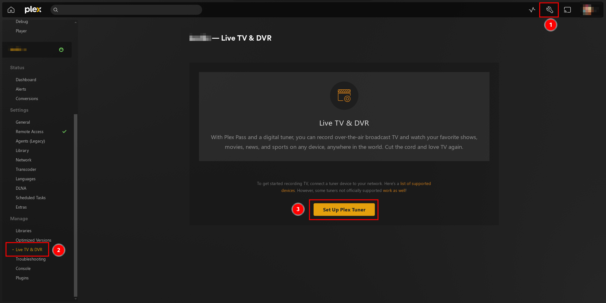
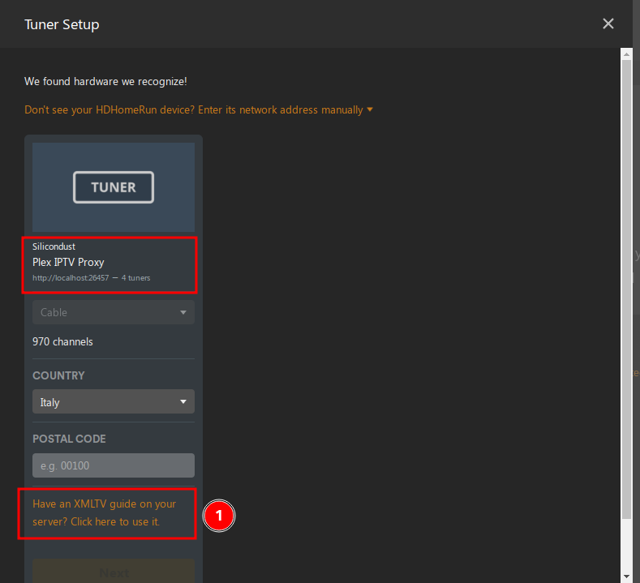
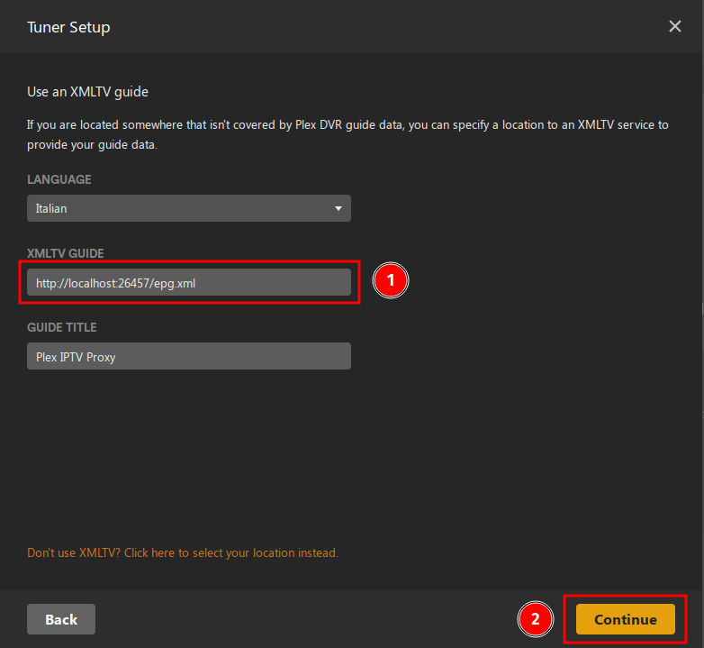
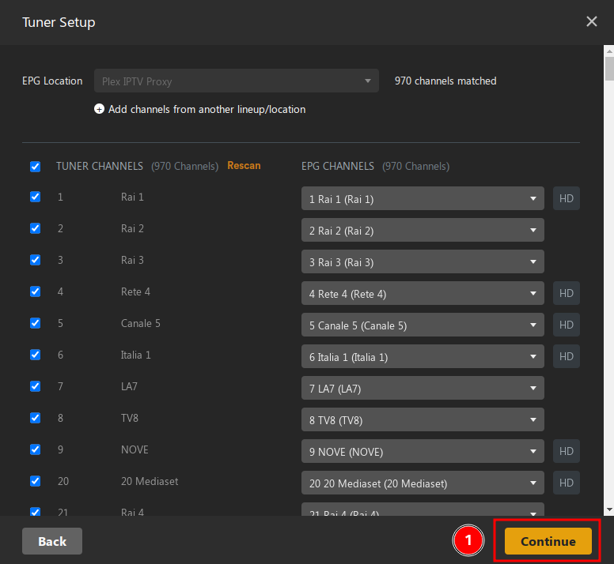
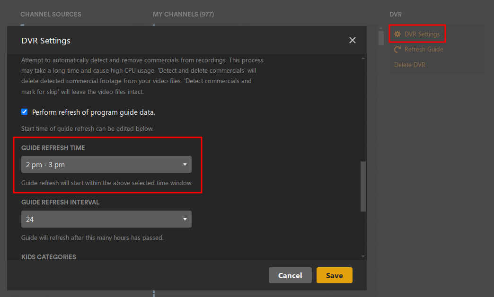

# Plex IPTV Proxy

> A software application that acts as a bridge between an IPTV (Internet Protocol Television) provider and a Plex media server.

## Introduction

This project allows users to specify multiple IPTV m3u8 playlists, generates an EPG (Electronic Program Guide) for each channel and makes the result available to a Plex media server.

## Motivation

This projects is born from the need to use many IPTV playlist providers at once and make the all available to Plex DVR (or similar).

Many IPTV playlists are limited to a number of channels and/or the channels you are interested in are scattered across multiple playlists. 

Furthermore, it is often difficult to associate an IPTV playlist with an EPG source: it usually takes long and tedious manual intervention in the plex interface.

This project aims to glue the two pieces together (iptv + epg) and make it easy to obtain an usable channel list which requires no further manual tweaking. 

## Features

* Retrieves and aggregates multiple M3U8 Playlists, extracts all channels (tracks) and test them individually using ffprobe to see if they are valid.
* Retrieves and aggregates EPG data from multiple EPG Sources and builds a tailor-made EPG for valid channels. 
* Gzip or uncompressed EPG formats supported.
* Tries to keep channel numbering consistent with what's indicated in the M3U8 playlists (if any channel number is indicated).
* Proxies video content to Plex Media Server using FFmpeg, optionally transcoding unsupported audio.
* Lightweight operation, the server is usually usable on low-end hardware (see [Performance considerations](#performance-considerations) below) 
* Supports generating an XMLTV EPG for Rakuten channels using their public JSON API 
* Supports configuration options for server port, tuner count, transcode audio, and more.

## Requirements

* FFmpeg (version 4 or higher)
* system wide nodejs (v20 or higher) is preferable but not strictly required: 
  the [installation script](#installation-as-a-systemd-service) (see below) will download and install the appropriate node.js version in the installation folder, in this case, however, either `curl` or `wget` is needed.

## Configuration
> :warning: please complete the configuration before [installing as a systemd service](#installation-as-a-systemd-service) (see below)

The configuration of Plex IPTV Proxy is done through a JSON file located at `data/config.json`. 

The configuration schema is defined using Zod and is as follows:

* iptvPlaylists: An array of strings representing the URLs of the IPTV playlists to use.
* epgSources: An array of strings representing URLs of EPGs to use for generating the aggregate EPG data, gzipped or uncompressed EPG are supported.
* server: An object with the following properties:
  * port: The port on which the Plex IPTV Proxy server will listen for incoming requests. (optional, defaults to `26457`)
  * tunerCount: The number of tuners to use for streaming. (optional, defaults to `4`)
  * transcodeAudio: An array of audio codecs that will be transcoded on the fly into `AAC-LP` before being sent to plex, each object has the following properties:
    * codec: The audio codec name.
    * profile: The (optional) profile of the unsupported audio codec.
* rakutenEpg: Allows to generate a Rakuten TV EPG from their public JSON API. An object with the following properties:
  * enabled: A boolean indicating whether to enable Rakuten EPG support.
  * classification_id: The classification ID to use for Rakuten EPG. (see [screenshot](docs/rakuten-params.png) for instructions on how to retrieve this data for your country)
  * locale: The locale to use for Rakuten EPG. (see [screenshot](docs/rakuten-params.png) for instructions on how to retrieve this data for your country)
  * market_code: The market code to use for Rakuten EPG. (see [screenshot](docs/rakuten-params.png) for instructions on how to retrieve this data for your country)

Here's an example configuration:

```json
{
  "server": {
    "port": 55555,
    "tunerCount": 4,
    "transcodeAudio": [
      {
        "codec": "aac",
        "profile": "HE-AAC"
      }
    ]
  },
  "iptvPlaylists": [
    "http://example.com/playlist.m3u8",
    "http://example2.com/playlist.m3u8"
  ],
  "epgSources": [
    "https://example.com/foo.xml.gz",
    "https://example2.com/bar.xml"
  ],
  "rakutenEpg": {
    "enabled": true,
    "classification_id": 123,
    "locale": "en-US",
    "market_code": "US"
  }
}
```
In this example, the `transcodeAudio` array specifies that the `aac` audio codec with profile `HE-AAC` needs to be transcoded because it is not supported by your plex app player.


## Installation as a systemd service

To install Plex IPTV Proxy, you can use the provided `install.sh` script to install and configure the necessary services. This script will:

* Create a new user and group for the Plex IPTV Proxy service
* Copy the project into a system folder of your choice (defaults to `/usr/lib/plex-iptv-proxy` if unspecified)
* If necessary, download node.js and make it available to the user executing the service.
* Set up the necessary permissions for the service to run
* Install the [systemd unit files](#systemd-services-and-timers) for the Plex IPTV Proxy service and timers (see below)

To use the install script, run the following command:

```bash
sudo ./install.sh
```
this will install in `/usr/lib/plex-iptv-proxy`

Alternatively manually specify an installation folder with:

```bash
sudo ./install.sh /installation/folder
```

This will install the necessary files in `/installation/folder` and configure them to start automatically on boot.

### Systemd services and timers

* `plex-iptv-proxy-server.service` is the main server, it is set to run on boot and restart if a crash occurs
* `plex-iptv-proxy-ffprobe.timer` tests your IPTV Playlists for validity, set to run weekly (frequency can be adjusted before installing or with an override like `sudo systemctl edit plex-iptv-proxy-ffprobe.timer`)
* `plex-iptv-proxy-epg-generator.timer` generates the tailor-made EPG, set to run every day at 10AM in order to make sure the epg provided has had ample time to generate his EPG (frequency/hour can be adjusted before installing or with an override like `sudo systemctl edit plex-iptv-proxy-epg-generator.timer`)

### Uninstallation

```bash
sudo ./uninstall.sh
```
Will undo what `install.sh` did. Please execute this if you'd like to uninstall the service and after a failed `install.sh` run.

## Configuration with Plex Media Server

> :warning: before following these steps, make sure the server is active and ready to accept requests, the first time you start the server it could take some time to properly generate your lineup + epg. Check the logs (e.g. `journalctl --unit plex-iptv-proxy-server`) and/or visit `http://server-address:port/lineup.json` and verify it's responding.

1. go to your plex DVR Setup interface and click "Setup Plex Tuner"

2. Make sure the address is correct then click `Have an XMLTV Guide on your server?` to continue

3. Enter your Plex IPTV Proxy address:port followed by `/epg.xml` (e.g `http://localhost:26457/epg.xml) + (optionally) name the XMLTV Guide.

4. Your channel lineup will appear and it will automatically be associated with the appropriated EPG guide.
5. (Optionally), disable channels you are not interested in.

6. (Optionally) set your guide refresh time to 2-3 hours **after** the time indicated in `plex-iptv-proxy-epg-generator.timer` (10AM By default, with a random delay of 100min)


## Testing configuration or running manually

It might be a good idea to test the configuration before [installing the project as a systemd service](#installation-as-a-systemd-service).

Or, in case you don't use `systemd` and want to use the app with another service manager, you can follow the instructions below in order to start a fully functional "Plex IPTV Proxy" which you can manage your way.

> :warning: you will need a working nodejs+npm installation available for your user (plus the usual ffmpeg)

1. Install dependencies
```bash
npm install
```

2. Start the server with 

```bash
npm run serve
```

> :information_source: NOTE: the first time you start the server, it will 
> * aggregate and test all the IPTV playlist you  provided in the configuration
> * generate the tailor-made aggregate EPG
>
> depending on how many IPTV playlist and EPG sources you provided, this process could be slow and the server will be unusable until the process is complete

After the server has been started, 
* navigate to http://localhost:26457/lineup.json and verify that the resulting lineup matches your expectations
* navigate to http://localhost:26457/epg.xml and verify that the resulting EPG matches your expectations

### Regenerating the lineup
In order to regenerate the lineup after you change the `iptvPlaylists` in `data/config`
```bash
npm run ffprobe-store-results
```
will regenerate the lineup, testing if the channels are usable and storing the results. This process may take some time.

> :information_source: NOTE: After this step is complete, it is generally advisable to run the steps to [regenerate the epg](#regenerating-the-epg) below.

### Regenerating the EPG

After you change `epgSources` in `data/config.json` you can run 

```bash
npm run generate-epg
```

this will only regenerate the EPG, which is much faster than regenerating the lineup from scratch.

> :information_source: NOTE: This requires completion of the steps to [generate the lineup](#regenerating-the-lineup) described above.

## Performance considerations

Heavyweight operations are 
1. Initial/weekly FFProbe testing: this operation is parallelized and rate-limited, still it takes a non-negligible amount of time and resources to complete.
2. Proxying channels with transcoded audio: this is controllable using `data/config.json`, empty the `server.transcodeAudio` array and no audio will be transcoded, ever, beware that your device may not support all types of audio streams though.

The rest of the server operations are as lightweight as possible:
* streams are proxy-ed to Plex with `vcodec: copy` and `acodec: copy` (except those marked otherwise, see above) 
* epg and ffprobe results are stored to disk and retrieved on-demand

The number of "tuners" `tunerCount` in `data/config.json` should be adjusted to match how many simultaneous audio streams your hardware can transcode at the same time, the default value of `4` should realistically be enough for the average household while lightweight enough to be run on a modest hardware setup (e.g. 1 programme being recorded by plex + 3 stream viewed simultaneously on various devices)


## Troubleshooting

* Check the application logs for errors (e.g. `journalctl --unit plex-iptv-proxy-server.service`)
* Verify IPTV provider and Plex media server settings
* Ensure FFmpeg is installed and available to all users

## Contributing

## License

This project is licensed under the MIT License. See the LICENSE file for details.